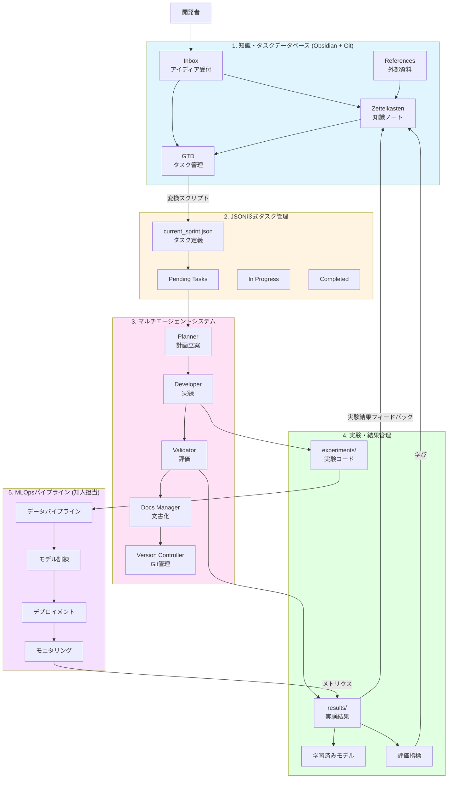
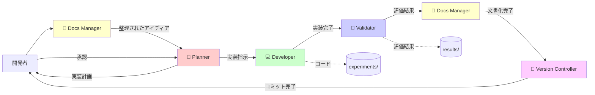
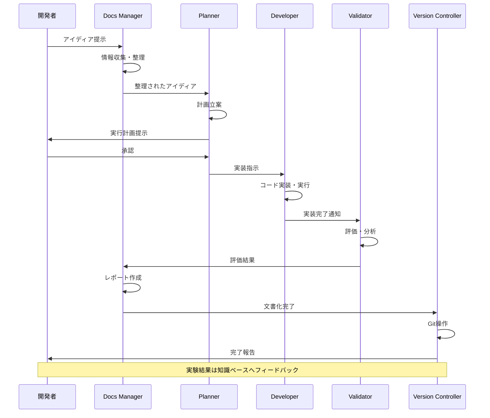
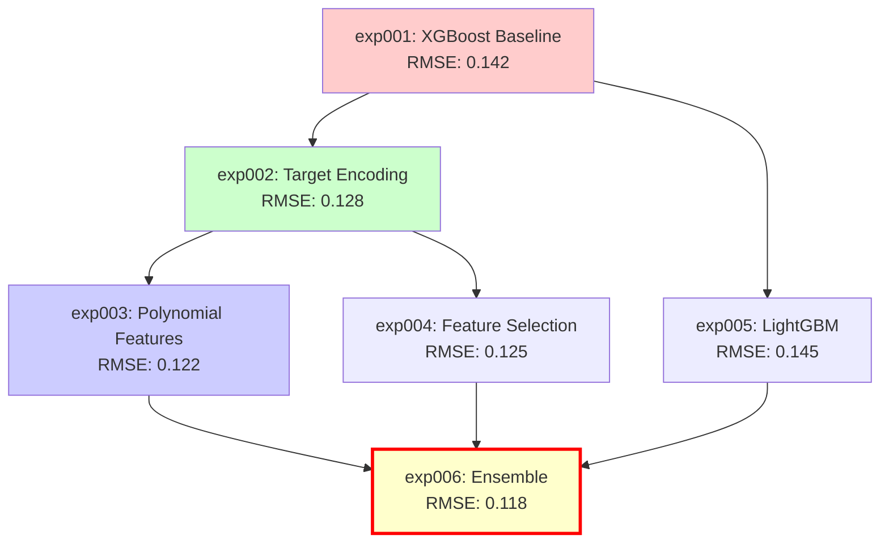
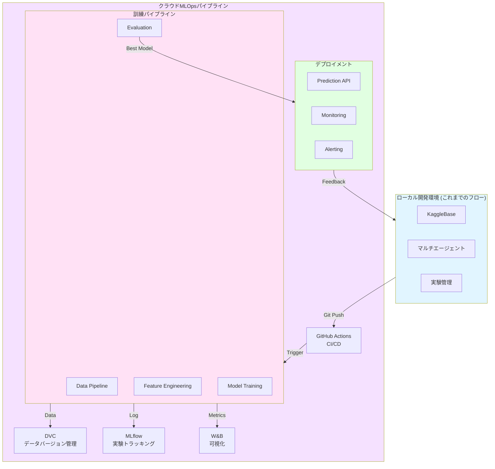
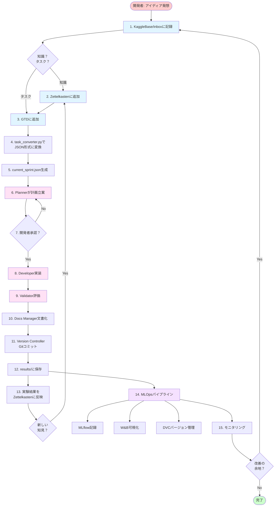
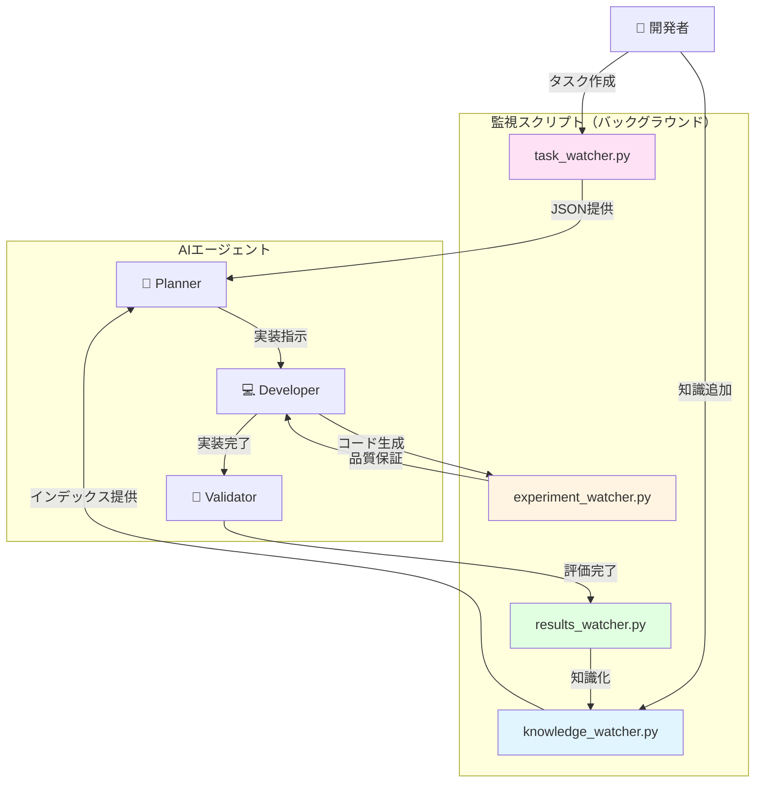

# Kaggle Competition Development Platform - アーキテクチャ設計書

> **📊 図の表示について**: このドキュメントにはMermaid図が多数含まれています。
> 図が表示されない場合は、**Markdownプレビュー**を開いてください（`Cmd+Shift+V`）。
> 詳しくは [Mermaid図の表示方法ガイド](./MERMAID_VIEWING_GUIDE.md) をご覧ください。

## エグゼクティブサマリー

本プロジェクトは、Kaggleコンペティションに参加するための統合開発プラットフォームです。知識管理（Zettelkasten + GTD）、JSON形式のタスク管理、マルチエージェントシステム、実験管理、MLOpsパイプラインの5つの主要コンポーネントから構成され、有機的な知識循環と効率的なチーム開発を実現します。

### プロジェクトの目的
- **知識の有機的循環**: 実験結果→知識蓄積→タスク生成→新たな実験のサイクル
- **効率的なチーム開発**: リアルタイムな情報共有と進捗の可視化
- **半自動化された実験フロー**: マルチエージェントによる実験の自動実行
- **スケーラブルなMLOps**: 将来的な本格運用への拡張性

---

## システム全体構成図

> **注**: この図はMarkdownプレビュー（`Cmd+Shift+V`または右上のプレビューアイコン）で表示されます。
> プレビューが表示されない場合は、下記のテキスト版をご参照ください。

### Mermaid図



---

## コンポーネント詳細設計

### 1. 知識・タスクデータベース (KaggleBase)

#### 概要
Obsidianを用いた知識管理システム。Zettelkasten（永続的な知識）とGTD（実行可能なタスク）を組み合わせ、有機的な知識循環を実現します。

#### 名称提案: **KaggleBase** (Kaggle Knowledge Base)
代替案: CompetitionVault, InsightHub, ML-Zettel

#### ディレクトリ構造

```
knowledge/
├── inbox/                      # 未整理の情報
│   ├── YYYYMMDD_idea.md       # アイディアメモ
│   └── YYYYMMDD_discussion.md # ディスカッション要約
│
├── zettelkasten/              # 知識ノート（永続的）
│   ├── 20240101000000_feature_engineering_basics.md
│   ├── 20240102000000_gradient_boosting_theory.md
│   └── index.md               # インデックス
│
├── tasks/                     # GTDタスク管理
│   ├── next_actions/          # 次にやるべきこと
│   ├── projects/              # プロジェクト（複数タスクの集合）
│   ├── waiting_for/           # 待機中
│   ├── someday_maybe/         # いつかやる
│   └── completed/             # 完了
│
├── projects/                  # プロジェクト固有の情報
│   ├── project_overview.md
│   └── team_communication.md  # チーム間コミュニケーション
│
└── references/                # 外部資料
    ├── papers/                # 論文
    ├── kaggle_discussions/    # Kaggleディスカッション要約
    └── benchmarks/            # ベンチマーク結果
```

#### タグ規則体系

##### 1. ステータスタグ
- `#status/inbox` - 未整理
- `#status/active` - アクティブ
- `#status/waiting` - 待機中
- `#status/completed` - 完了
- `#status/archived` - アーカイブ

##### 2. タイプタグ
- `#type/knowledge` - 知識ノート（Zettelkasten）
- `#type/task` - タスク（GTD）
- `#type/idea` - アイディア
- `#type/project` - プロジェクト
- `#type/reference` - 参考資料
- `#type/experiment-result` - 実験結果

##### 3. ドメインタグ（機械学習領域）
- `#domain/feature-engineering` - 特徴量エンジニアリング
- `#domain/model` - モデル構築
- `#domain/evaluation` - 評価・検証
- `#domain/data-analysis` - データ分析
- `#domain/preprocessing` - 前処理
- `#domain/ensemble` - アンサンブル
- `#domain/optimization` - ハイパーパラメータ最適化

##### 4. ソースタグ（情報源）
- `#source/kaggle-discussion` - Kaggleディスカッション
- `#source/paper` - 学術論文
- `#source/experiment` - 自分の実験結果
- `#source/brainstorm` - ブレインストーミング
- `#source/teammate` - チームメイトからの情報
- `#source/external-blog` - 外部ブログ

##### 5. 優先度タグ
- `#priority/critical` - 最優先
- `#priority/high` - 高
- `#priority/medium` - 中
- `#priority/low` - 低

##### 6. プロジェクトタグ
- `#project/[competition-name]` - コンペ固有
- `#project/infrastructure` - インフラ整備
- `#project/research` - 研究・調査

#### Zettelkastenノートテンプレート

```markdown
---
id: 20240101000000
title: Gradient Boostingの基礎理論
type: knowledge
tags: 
  - domain/model
  - source/paper
  - project/house-prices
created: 2024-01-01T10:00:00
updated: 2024-01-15T14:30:00
links:
  - 20240102000000  # 関連ノートへのリンク
  - 20240103000000
---

# Gradient Boostingの基礎理論

## 概要
Gradient Boostingの基本的な考え方と数学的背景について...

## 主要な概念
1. 損失関数の勾配
2. 弱学習器の逐次追加
3. 学習率とその影響

## 実践的な知見
- XGBoost vs LightGBM vs CatBoost
- ハイパーパラメータのチューニング戦略

## 関連タスク
- [[task-001-xgboost-baseline]]
- [[task-002-lightgbm-experiment]]

## 参考文献
- [論文タイトル](URL)
- Kaggle Discussion: [タイトル](URL)

## 学んだこと
実験exp001の結果から、学習率を0.1から0.05に下げることで...
```

#### GTDタスクテンプレート

```markdown
---
id: task-001
title: XGBoostベースラインモデルの構築
type: task
status: active
priority: high
project: house-prices
tags:
  - domain/model
  - priority/high
created: 2024-01-15T09:00:00
due_date: 2024-01-20
related_notes:
  - 20240101000000  # Gradient Boostingの基礎理論
  - 20240105000000  # XGBoostのベストプラクティス
dependencies: []
next_actions:
  - データの読み込みとEDA
  - 基本的な前処理パイプライン構築
  - XGBoostモデルの訓練
---

# XGBoostベースラインモデルの構築

## 目的
House Pricesコンペの初期ベースラインとして、XGBoostモデルを構築し評価する。

## 期待される成果
- RMSE < 0.15
- クロスバリデーションスコアの標準偏差 < 0.01
- 特徴量重要度の可視化

## 実行手順
1. データの読み込み（train.csv, test.csv）
2. 欠損値の確認と基本的な補完
3. カテゴリカル変数のラベルエンコーディング
4. XGBoostモデルの訓練（デフォルトパラメータ）
5. 5-fold CVによる評価
6. 提出用CSV生成

## リスクと対策
- **リスク**: 過学習の可能性
  - **対策**: early_stoppingを使用、max_depthを制限
- **リスク**: カテゴリカル変数の処理が不適切
  - **対策**: ターゲットエンコーディングも試す

## 完了条件
- [ ] 実験コードが`experiments/exp001/`に保存されている
- [ ] 評価結果が`results/exp001/`に保存されている
- [ ] 実験レポートが作成されている
- [ ] Gitにコミットされている

## 実験結果（後で記入）
- 実験ID: exp001
- RMSE: 
- CV Score: 
- 学んだこと:
```

#### Kaggle Discussion自動取り込みパイプライン（将来実装）

```python
# scripts/sync_kaggle_discussions.py
"""
Kaggle APIを使用してディスカッションを定期的に取得し、
knowledge/references/kaggle_discussions/に保存するスクリプト
"""

import kaggle
from datetime import datetime

def fetch_competition_discussions(competition_name):
    """コンペのディスカッションを取得"""
    # Kaggle API経由でディスカッション取得
    pass

def convert_to_markdown(discussion):
    """ディスカッションをMarkdown形式に変換"""
    # Zettelkastenフォーマットで保存
    pass

def update_knowledge_base():
    """新規ディスカッションを知識ベースに追加"""
    pass
```

---

### 2. JSON形式タスク管理システム

#### 概要
ObsidianのGTDタスクをJSON形式に変換し、マルチエージェントシステムに引き渡す仕組み。SSOT（`knowledge/tasks/`）から `src/task_converter.py` で `tasks/current_sprint.json` を生成します。

#### タスクJSON スキーマ (v2)

```json
{
  "version": "1.0",
  "schema_version": 2,
  "description": "AIエージェント向けタスク指示書",
  "competition": "house-prices-advanced-regression-techniques",
  "items": [
    {
      "id": "task-001",
      "title": "XGBoostベースラインモデルの構築",
      "summary": "初期ベースラインとしてXGBoostモデルを構築・評価する",
      "status": "pending",
      "category": "core",
      "priority": "high",
      "start_date": "2024-01-15",
      "end_date": "2024-01-20",
      "actual_start_date": null,
      "actual_end_date": null,
      "progress_perc": 0,
      "deps": [],
      "detail_markdown": "knowledge/tasks/next_actions/task-001.md",
      "report_markdown": null,
      "assigned_agent": "planner",
      "expected_outcome": {
        "type": "experiment",
        "metrics": {
          "RMSE": {"target": "<0.15", "baseline": null},
          "CV_std": {"target": "<0.01", "baseline": null}
        },
        "deliverables": [
          "experiments/exp001/",
          "results/exp001/",
          "実験レポート"
        ]
      },
      "computational_resources": {
        "estimated_time_minutes": 30,
        "gpu_required": false,
        "memory_gb": 4
      }
    }
  ],
  "notes": {
    "strategy": "まずはシンプルなベースラインから始め、段階的に改善",
    "base_branch": "develop"
  }
}
```

#### タスク変換スクリプト

```python
# src/task_converter.py
"""
ObsidianのMarkdownタスクをJSON形式に変換するスクリプト
"""

import os
import json
import yaml
from pathlib import Path
from datetime import datetime

def parse_markdown_task(md_path):
    """Markdownタスクファイルを解析"""
    with open(md_path, 'r', encoding='utf-8') as f:
        content = f.read()
    
    # YAMLフロントマターの抽出
    if content.startswith('---'):
        parts = content.split('---', 2)
        metadata = yaml.safe_load(parts[1])
        body = parts[2]
    else:
        raise ValueError("YAMLフロントマターが見つかりません")
    
    return metadata, body

def convert_to_json_task(metadata, body):
    """Markdown形式をJSON形式に変換"""
    return {
        "id": metadata.get('id'),
        "title": metadata.get('title'),
        "summary": extract_summary(body),
        "status": metadata.get('status', 'pending'),
        "category": determine_category(metadata),
        "priority": metadata.get('priority', 'medium'),
        # ... 他のフィールド
    }

def generate_plan_json(task_dir, output_path):
    """タスクディレクトリからcurrent_sprint.jsonを生成"""
    tasks = []
    for md_file in Path(task_dir).glob('*.md'):
        if md_file.name == 'README.md':
            continue
        metadata, body = parse_markdown_task(md_file)
        task_json = convert_to_json_task(metadata, body)
        tasks.append(task_json)
    
    plan = {
        "version": "1.0",
        "schema_version": 2,
        "description": "AIエージェント向けタスク指示書",
        "items": tasks,
        "notes": {
            "generated_at": datetime.now().isoformat(),
            "source": str(task_dir)
        }
    }
    
    with open(output_path, 'w', encoding='utf-8') as f:
        json.dump(plan, f, indent=2, ensure_ascii=False)
    
    print(f"✓ current_sprint.jsonを生成しました: {output_path}")

if __name__ == "__main__":
    generate_plan_json(
        task_dir="knowledge/tasks/next_actions",
        output_path="tasks/current_sprint.json"
    )
```

#### タスク優先度計算と計算資源割り当て（将来実装）

```python
# src/task_scheduler.py
"""
タスクの優先度と計算資源を考慮した実行計画の立案
W&B (Weights & Biases) との統合も検討
"""

import json
from datetime import datetime, timedelta

class TaskScheduler:
    def __init__(self, tasks_json_path, available_resources):
        self.tasks = self.load_tasks(tasks_json_path)
        self.resources = available_resources
    
    def calculate_priority_score(self, task):
        """優先度スコアの計算"""
        # 期日までの日数
        days_until_due = (task['end_date'] - datetime.now()).days
        
        # 依存関係の深さ
        dependency_depth = self.get_dependency_depth(task)
        
        # 優先度マッピング
        priority_map = {'critical': 100, 'high': 75, 'medium': 50, 'low': 25}
        priority_score = priority_map.get(task['priority'], 50)
        
        # 総合スコア
        score = priority_score - (days_until_due * 2) + (dependency_depth * 10)
        return score
    
    def optimize_execution_plan(self):
        """計算資源を考慮した最適な実行計画を立案"""
        # タスクを優先度順にソート
        sorted_tasks = sorted(
            self.tasks, 
            key=self.calculate_priority_score, 
            reverse=True
        )
        
        # 計算資源の制約を考慮してスケジューリング
        schedule = []
        current_time = datetime.now()
        
        for task in sorted_tasks:
            if self.can_schedule(task, current_time):
                schedule.append({
                    'task_id': task['id'],
                    'start_time': current_time,
                    'estimated_duration': task['computational_resources']['estimated_time_minutes']
                })
                current_time += timedelta(
                    minutes=task['computational_resources']['estimated_time_minutes']
                )
        
        return schedule
    
    def integrate_with_wandb(self, schedule):
        """W&Bとの統合（実験トラッキング）"""
        import wandb
        
        wandb.init(project="kaggle-task-scheduling")
        
        for item in schedule:
            wandb.log({
                "task_id": item['task_id'],
                "scheduled_start": item['start_time'].isoformat(),
                "estimated_duration": item['estimated_duration']
            })
```

---

### 3. マルチエージェントシステム

#### 概要
Cursor/VSCode内で動作する5つの専門AIエージェントが協調して実験を実行します。各エージェントは明確に定義された役割を持ち、他のエージェントの領域に侵入しません。

#### エージェント構成図



#### エージェント詳細仕様

##### 1. 🧠 Planner (指揮官)

**役割**: 論理的な実行計画の立案、タスク分解、専門エージェントへの委譲

**入力**:
- `tasks/pending/`からのタスクJSON
- Docs Managerからの整理されたアイディア

**処理**:
1. タスクの目的と仮説を明確化
2. 具体的な実装手順を立案
3. 期待される成果を定量化
4. リスク要因と対策を特定
5. 適切なエージェントに作業を割り当て

**出力形式**:
```
[Plan:]
- 実装の目的: XGBoostベースラインモデルの構築
- 仮説: デフォルトパラメータでもRMSE < 0.15を達成できる
- 実装手順:
  1. データ読み込みと基本的なEDA (Developer担当)
  2. 前処理パイプライン構築 (Developer担当)
  3. モデル訓練と評価 (Developer→Validator)
- 期待される成果: RMSE < 0.15, CV安定性確認
- リスク: 過学習の可能性 → early_stopping使用

[Action:]
@Developer: experiments/exp001/を作成し、上記手順1-3を実装してください
```

**制約**:
- コード生成は禁止
- 常に`[Plan:]`と`[Action:]`の形式で出力
- 意思決定と指示出しに専念

##### 2. 💻 Developer (実装者)

**役割**: データ処理、特徴量生成、モデル訓練のPython実装と実行

**入力**:
- Plannerからの実装指示
- タスクJSONの詳細仕様

**処理**:
1. `experiments/expNNN/`ディレクトリの作成
2. Pythonコードの実装
3. コードの実行
4. 結果ファイルの生成

**出力形式**:
````python
# experiments/exp001/train.py
import pandas as pd
import xgboost as xgb
from sklearn.model_selection import cross_val_score

# データ読み込み
train = pd.read_csv('../../data/raw/train.csv')
# ... (実装コード)

[Result:]
✓ 実験exp001を完了しました
- RMSE: 0.142
- CV Score: 0.138 ± 0.012
- 実装ファイル: experiments/exp001/
- 所要時間: 12分
````

**制約**:
- 評価ロジックの断定は禁止（Validatorの役割）
- 長文の考察・レポートは禁止（Docs Managerの役割）
- 出力はコードブロックと`[Result:]`のみ

##### 3. 🧪 Validator (評価者)

**役割**: コンペ評価指標に基づく厳密な評価とロジックレビュー

**入力**:
- Developerの実装結果
- `results/expNNN/`の結果ファイル

**処理**:
1. モデル性能の客観的評価
2. 評価指標の計算（RMSE, MAE, R²など）
3. クロスバリデーション結果の分析
4. 特徴量重要度の可視化
5. 結果の解釈と改善点の提示

**出力形式**:
````python
# 評価コード
import numpy as np
import matplotlib.pyplot as plt

# 評価指標の計算
rmse = np.sqrt(mean_squared_error(y_true, y_pred))
# ... (評価コード)

[Evaluation Results:]
- RMSE: 0.142 (目標: <0.15) ✓
- CV Score: 0.138 ± 0.012 (安定性良好)
- 特徴量重要度TOP3: LotArea, OverallQual, GrLivArea

[Next Insight:]
改善提案:
1. カテゴリカル変数のターゲットエンコーディング追加でRMSE 0.12まで改善の可能性
2. 外れ値処理が不十分 → GrLivArea > 4000の物件を除外すべき
3. max_depth=6は深すぎる可能性 → 4-5で再実験を推奨
````

**制約**:
- 学習/推論コードの再生成は禁止（Developerの役割）
- 出力は評価コードと`[Next Insight]`に限定

##### 4. 📝 Docs Manager (文書化・情報収集)

**役割**: 情報収集・要約・最終レポート整備

**フェーズ1入力** (実験開始前):
- ユーザーのアイディア
- 関連ドキュメント

**フェーズ1出力**:
```markdown
[アイディア整理]
目的: XGBoostベースラインモデルの構築
背景: コンペ初期段階でシンプルなベースラインが必要
関連知識: 
- [[20240101000000]] Gradient Boostingの基礎理論
- [[20240105000000]] XGBoostベストプラクティス
前回の実験: なし（初回実験）

[コンテキスト]
- データセット: House Prices (1460行, 80特徴量)
- 評価指標: RMSE
- 現在のベストスコア: なし
```

**フェーズ2入力** (実験完了後):
- Validatorの評価結果
- Developerの実装コード

**フェーズ2出力**:
```markdown
# 実験レポート: exp001 - XGBoostベースライン

## 実験概要
- 実験ID: exp001
- 実施日: 2024-01-15
- 目的: XGBoostでシンプルなベースラインを構築

## 実装内容
- モデル: XGBoost (デフォルトパラメータ)
- 前処理: 欠損値補完、ラベルエンコーディング
- 検証方法: 5-fold CV

## 結果
- RMSE: 0.142
- CV Score: 0.138 ± 0.012

## 学んだこと
1. デフォルトパラメータでも目標達成
2. GrLivAreaに外れ値が存在
3. カテゴリカル変数の処理改善の余地あり

## 次のステップ
- exp002: 外れ値除去 + ターゲットエンコーディング
```

**制約**:
- Pythonコード生成は禁止
- 出力はMarkdownレポートまたは要約に限定

##### 5. 🐙 Version Controller (Git管理)

**役割**: 変更の記録、コミット/プッシュ、タグ/リリース管理

**入力**:
- 全ファイル（コード、結果、ドキュメント）

**処理**:
1. 変更ファイルの確認
2. 適切なコミットメッセージの生成
3. Gitコミットの実行
4. 必要に応じてタグ付け

**出力形式**:
```bash
# 実行すべきGitコマンド

git add experiments/exp001/
git add results/exp001/
git add knowledge/zettelkasten/20240115000000_exp001_xgboost_baseline.md
git commit -m "feat(exp001): XGBoostベースラインモデルを構築

- デフォルトパラメータでRMSE 0.142を達成
- 5-fold CVで安定性確認 (0.138 ± 0.012)
- 外れ値とカテゴリカル変数処理に改善の余地
- 次のステップ: ターゲットエンコーディングとoutlier除去

Closes: task-001
"

# タグ付け（マイルストーン時）
git tag -a v0.1.0-exp001 -m "初回ベースライン完成"
```

**コミットメッセージ規約**:
```
<type>(<scope>): <subject>

<body>

<footer>
```

**タイプ**:
- `feat`: 新機能（新実験）
- `fix`: バグ修正
- `refactor`: リファクタリング
- `docs`: ドキュメント
- `chore`: その他

**制約**:
- Pythonコード生成は禁止
- 出力はGitコマンドとその説明に限定

#### エージェント連携フロー



#### Git運用戦略

##### ブランチ戦略

```
main (本番ブランチ)
└── develop (開発ブランチ)
    ├── feature/exp001-xgboost-baseline
    ├── feature/exp002-target-encoding
    └── feature/infrastructure-wandb-integration
```

**ブランチルール**:
- `main`: 提出可能な安定版のみ
- `develop`: 開発中のコード統合
- `feature/exp[NNN]-*`: 実験ごとのブランチ
- `feature/infrastructure-*`: インフラ整備用

##### マージ戦略

1. **実験ブランチ → develop**:
   - Pull Request作成
   - チームメイトのレビュー（任意）
   - マージ後、結果をObsidianに反映

2. **develop → main**:
   - マイルストーン達成時（例: 提出可能なモデル完成）
   - タグ付け（例: `v1.0.0-submission-001`）

##### .gitignore設定

```gitignore
# データファイル
data/raw/*.csv
data/processed/*.csv
*.pkl
*.h5
*.hdf5

# モデルファイル（大容量）
results/**/model.pkl
results/**/*.joblib

# 一時ファイル
.ipynb_checkpoints/
__pycache__/
*.pyc

# Obsidian設定（個人設定）
knowledge/.obsidian/workspace*
knowledge/.obsidian/cache

# 環境設定
.env
.venv/
venv/
```

**重要**: 実験結果の`metrics.json`や`plots/`は**Git管理対象**とする

---

### 4. 実験・結果管理 (Experiments & Results)

#### 概要
各実験は一意のIDで管理され、コード、結果、メタデータが体系的に保存されます。画像で示されたディレクトリ構造を採用します。

#### ディレクトリ構造（詳細版）

```
project/
├── experiments/              # 実験ごとのコード管理
│   ├── exp001/              # 実験ID: exp001
│   │   ├── train.py         # 学習コード
│   │   ├── utils.py         # ユーティリティ関数
│   │   ├── config.yaml      # パラメータ設定
│   │   ├── README.md        # 実験概要
│   │   └── notebook.ipynb   # (オプション) 探索的分析用
│   │
│   ├── exp002/              # 実験ID: exp002
│   │   ├── train.py
│   │   ├── utils.py
│   │   ├── config.yaml
│   │   └── README.md
│   │
│   └── exp003/              # 実験ID: exp003
│       ├── train.py
│       ├── utils.py
│       └── config.yaml
│
└── results/                 # 実験ごとの出力結果
    ├── exp001/              # 実験ID: exp001 の結果
    │   ├── result.csv       # 評価結果
    │   ├── model.pkl        # 学習済みモデル
    │   ├── metrics.json     # 評価指標
    │   ├── feature_importance.png
    │   ├── cv_results.json  # クロスバリデーション結果
    │   └── logs/
    │       └── training.log
    │
    ├── exp002/              # 実験ID: exp002 の結果
    │   ├── result.csv
    │   ├── model.pkl
    │   ├── metrics.json
    │   └── plots/
    │       ├── confusion_matrix.png
    │       └── roc_curve.png
    │
    └── exp003/              # 実験ID: exp003 の結果
        ├── result.csv
        ├── model.pkl
        └── metrics.json
```

#### 実験IDの命名規則

**基本形式**: `exp[NNN]` (3桁ゼロパディング)

**例**:
- `exp001`: 初回ベースライン
- `exp002`: 外れ値除去版
- `exp023`: アンサンブルモデル
- `exp100`: 最終提出版

**ディレクトリ名** (オプション): `exp[NNN]_[short-description]`
- `exp001_xgboost_baseline`
- `exp002_target_encoding`
- `exp003_outlier_removal`

#### config.yaml テンプレート

```yaml
# experiments/exp001/config.yaml

experiment:
  id: "exp001"
  name: "XGBoost Baseline"
  description: "デフォルトパラメータでのベースライン構築"
  created_at: "2024-01-15T10:00:00"
  parent_experiment: null  # 派生元の実験ID（初回はnull）
  tags:
    - baseline
    - xgboost

data:
  train_path: "../../data/raw/train.csv"
  test_path: "../../data/raw/test.csv"
  processed_path: "../../data/processed/exp001/"

model:
  type: "XGBoost"
  parameters:
    objective: "reg:squarederror"
    max_depth: 6
    learning_rate: 0.1
    n_estimators: 100
    subsample: 0.8
    colsample_bytree: 0.8
    random_state: 42

preprocessing:
  missing_value_strategy: "median"
  categorical_encoding: "label"
  scaling: "standard"
  outlier_removal: false

validation:
  method: "k-fold"
  n_folds: 5
  shuffle: true
  random_state: 42

output:
  results_dir: "../../results/exp001/"
  save_model: true
  save_predictions: true
  save_plots: true
```

#### metrics.json テンプレート

```json
{
  "experiment_id": "exp001",
  "timestamp": "2024-01-15T12:30:00Z",
  "duration_seconds": 720,
  "metrics": {
    "train": {
      "rmse": 0.102,
      "mae": 0.075,
      "r2": 0.935
    },
    "validation": {
      "rmse": 0.142,
      "mae": 0.105,
      "r2": 0.881,
      "cv_scores": [0.138, 0.142, 0.135, 0.145, 0.140],
      "cv_mean": 0.140,
      "cv_std": 0.0037
    },
    "test": {
      "predictions_saved": true,
      "submission_ready": true
    }
  },
  "feature_importance": {
    "OverallQual": 0.185,
    "GrLivArea": 0.142,
    "LotArea": 0.098,
    "YearBuilt": 0.087,
    "TotalBsmtSF": 0.072
  },
  "hyperparameters": {
    "max_depth": 6,
    "learning_rate": 0.1,
    "n_estimators": 100
  },
  "notes": "デフォルトパラメータで目標達成。次はターゲットエンコーディングを試す。"
}
```

#### 実験の系統樹管理（Obsidian Graph View活用）

##### 派生関係の記録方法

各実験の`README.md`に親実験を記載：

```markdown
---
id: exp002
parent: exp001
children: [exp003, exp004]
status: completed
---

# Experiment 002: ターゲットエンコーディング追加

## 派生元
[[exp001]] XGBoostベースライン

## このexperimentで試したこと
- カテゴリカル変数のターゲットエンコーディング
- 外れ値の除去

## 結果
RMSE: 0.142 → 0.128 (改善!)

## 派生先
- [[exp003]]: さらにPolynomial特徴量を追加
- [[exp004]]: LightGBMで同様の前処理を試す
```

##### Obsidian Graph View での可視化



**実装方法**:
1. 各実験の`README.md`にWikilinks形式で関連を記述
2. Obsidianが自動的にグラフを生成
3. タグ `#best-score` で最良モデルをマーキング

#### 実験テンプレート自動生成スクリプト

```python
# src/create_experiment.py
"""
新規実験のディレクトリ構造を自動生成するスクリプト
"""

import os
import yaml
import json
from pathlib import Path
from datetime import datetime

def create_experiment(exp_id, description, parent_exp=None):
    """
    新規実験のディレクトリとテンプレートファイルを作成
    
    Args:
        exp_id (str): 実験ID (例: "exp001")
        description (str): 実験の説明
        parent_exp (str): 派生元の実験ID (オプション)
    """
    # ディレクトリ作成
    exp_dir = Path(f"experiments/{exp_id}")
    res_dir = Path(f"results/{exp_id}")
    
    exp_dir.mkdir(parents=True, exist_ok=True)
    res_dir.mkdir(parents=True, exist_ok=True)
    
    # README.md
    readme_content = f"""---
id: {exp_id}
parent: {parent_exp if parent_exp else 'null'}
status: in_progress
created: {datetime.now().isoformat()}
---

# Experiment {exp_id}: {description}

## 目的


## 仮説


## 実装内容


## 期待される成果


## 結果
（実験後に記入）

## 学んだこと
（実験後に記入）
"""
    
    with open(exp_dir / "README.md", "w") as f:
        f.write(readme_content)
    
    # config.yaml (親実験から継承)
    if parent_exp:
        parent_config_path = Path(f"experiments/{parent_exp}/config.yaml")
        if parent_config_path.exists():
            with open(parent_config_path, 'r') as f:
                config = yaml.safe_load(f)
            config['experiment']['id'] = exp_id
            config['experiment']['parent_experiment'] = parent_exp
        else:
            config = create_default_config(exp_id)
    else:
        config = create_default_config(exp_id)
    
    with open(exp_dir / "config.yaml", "w") as f:
        yaml.dump(config, f, default_flow_style=False, allow_unicode=True)
    
    # train.py テンプレート
    train_template = f"""\"\"\"
Experiment {exp_id}: {description}
\"\"\"

import pandas as pd
import yaml
from pathlib import Path

# 設定読み込み
with open('config.yaml', 'r') as f:
    config = yaml.safe_load(f)

# データ読み込み
train_df = pd.read_csv(config['data']['train_path'])
test_df = pd.read_csv(config['data']['test_path'])

# 前処理


# モデル訓練


# 評価


# 結果保存

"""
    
    with open(exp_dir / "train.py", "w") as f:
        f.write(train_template)
    
    print(f"✓ 実験 {exp_id} を作成しました")
    print(f"  - experiments/{exp_id}/")
    print(f"  - results/{exp_id}/")
    
def create_default_config(exp_id):
    """デフォルトのconfig.yamlを生成"""
    return {
        'experiment': {
            'id': exp_id,
            'created_at': datetime.now().isoformat(),
            'parent_experiment': None
        },
        'data': {
            'train_path': '../../data/raw/train.csv',
            'test_path': '../../data/raw/test.csv'
        },
        'model': {},
        'output': {
            'results_dir': f'../../results/{exp_id}/'
        }
    }

if __name__ == "__main__":
    import argparse
    
    parser = argparse.ArgumentParser()
    parser.add_argument('--id', required=True, help='実験ID (例: exp001)')
    parser.add_argument('--desc', required=True, help='実験の説明')
    parser.add_argument('--parent', help='派生元の実験ID')
    
    args = parser.parse_args()
    
    create_experiment(args.id, args.desc, args.parent)
```

**使用例**:
```bash
# 初回実験
python src/create_experiment.py --id exp001 --desc "XGBoostベースライン"

# exp001から派生
python src/create_experiment.py --id exp002 --desc "ターゲットエンコーディング" --parent exp001
```

---

### 5. MLOpsパイプライン (知人担当)

#### 概要
4つまでのローカル開発フローをクラウド環境に統合し、リアルタイムな運用を可能にする本格的なMLOpsパイプライン。知人のエンジニアが担当します。

#### 想定される構成要素



#### 統合ポイント

##### 1. GitHub Actionsによる自動実験実行

```yaml
# .github/workflows/run_experiment.yml
name: Run Experiment

on:
  push:
    branches:
      - 'feature/exp*'
  workflow_dispatch:
    inputs:
      experiment_id:
        description: '実験ID (例: exp001)'
        required: true

jobs:
  experiment:
    runs-on: ubuntu-latest
    steps:
      - uses: actions/checkout@v3
      
      - name: Set up Python
        uses: actions/setup-python@v4
        with:
          python-version: '3.10'
      
      - name: Install dependencies
        run: pip install -r requirements.txt
      
      - name: Download data with DVC
        run: dvc pull
      
      - name: Run experiment
        run: |
          cd experiments/${{ github.event.inputs.experiment_id }}
          python train.py
      
      - name: Upload results
        run: dvc add results/${{ github.event.inputs.experiment_id }}
      
      - name: Log to MLflow
        env:
          MLFLOW_TRACKING_URI: ${{ secrets.MLFLOW_URI }}
        run: python src/log_to_mlflow.py --exp_id ${{ github.event.inputs.experiment_id }}
```

##### 2. DVCによるデータ・モデル管理

```yaml
# .dvc/config
[core]
    remote = storage

['remote "storage"']
    url = s3://kaggle-experiments/house-prices
    
['remote "local"']
    url = /tmp/dvc-cache
```

**使用例**:
```bash
# データをバージョン管理
dvc add data/raw/train.csv
dvc add results/exp001/model.pkl

# リモートにプッシュ
dvc push

# チームメイトが最新データを取得
dvc pull
```

##### 3. MLflowによる実験トラッキング

```python
# src/log_to_mlflow.py
"""
実験結果をMLflowに記録するスクリプト
"""

import mlflow
import json
import yaml
from pathlib import Path

def log_experiment_to_mlflow(exp_id):
    """実験結果をMLflowにログ"""
    
    # メトリクス読み込み
    metrics_path = Path(f"results/{exp_id}/metrics.json")
    with open(metrics_path, 'r') as f:
        metrics = json.load(f)
    
    # 設定読み込み
    config_path = Path(f"experiments/{exp_id}/config.yaml")
    with open(config_path, 'r') as f:
        config = yaml.safe_load(f)
    
    # MLflowに記録
    with mlflow.start_run(run_name=exp_id):
        # パラメータ
        mlflow.log_params(config['model']['parameters'])
        
        # メトリクス
        mlflow.log_metrics({
            'rmse': metrics['metrics']['validation']['rmse'],
            'cv_mean': metrics['metrics']['validation']['cv_mean'],
            'cv_std': metrics['metrics']['validation']['cv_std']
        })
        
        # アーティファクト
        mlflow.log_artifact(f"results/{exp_id}/model.pkl")
        mlflow.log_artifact(f"results/{exp_id}/metrics.json")
        
        # タグ
        mlflow.set_tags({
            'experiment_id': exp_id,
            'parent': config['experiment'].get('parent_experiment', 'null')
        })

if __name__ == "__main__":
    import argparse
    parser = argparse.ArgumentParser()
    parser.add_argument('--exp_id', required=True)
    args = parser.parse_args()
    
    log_experiment_to_mlflow(args.exp_id)
```

##### 4. Weights & Biases (W&B) による可視化

```python
# experiments/exp001/train.py に追加
import wandb

# W&B初期化
wandb.init(
    project="kaggle-house-prices",
    name=f"exp001",
    config=config['model']['parameters']
)

# 訓練ループでログ
for epoch in range(n_epochs):
    # ... 訓練処理
    wandb.log({
        'epoch': epoch,
        'train_rmse': train_rmse,
        'val_rmse': val_rmse
    })

# 最終結果
wandb.log({
    'final_rmse': final_rmse,
    'cv_mean': cv_mean,
    'cv_std': cv_std
})

wandb.finish()
```

##### 5. 計算資源の最適割り当て（将来実装）

タスクの優先度と計算資源を考慮した自動スケジューリング：

```python
# src/mlops/resource_scheduler.py
"""
クラウド計算資源の最適割り当てスケジューラ
"""

class ResourceScheduler:
    def __init__(self, available_gpus, available_cpus):
        self.gpus = available_gpus
        self.cpus = available_cpus
    
    def schedule_experiments(self, task_queue):
        """
        優先度と計算資源要件に基づいて実験をスケジューリング
        
        Args:
            task_queue: TaskSchedulerからのタスクリスト
        
        Returns:
            実行計画（どの実験をどのリソースで実行するか）
        """
        schedule = []
        
        # 優先度順にソート
        sorted_tasks = sorted(
            task_queue, 
            key=lambda x: x['priority_score'], 
            reverse=True
        )
        
        gpu_queue = []
        cpu_queue = []
        
        for task in sorted_tasks:
            if task['computational_resources']['gpu_required']:
                gpu_queue.append(task)
            else:
                cpu_queue.append(task)
        
        # GPU実験を優先的に割り当て
        for i, task in enumerate(gpu_queue):
            if i < self.gpus:
                schedule.append({
                    'task_id': task['id'],
                    'resource': f'gpu-{i}',
                    'estimated_start': 'immediate'
                })
            else:
                schedule.append({
                    'task_id': task['id'],
                    'resource': 'gpu-queue',
                    'estimated_start': 'waiting'
                })
        
        return schedule
```

#### インターフェース設計

ローカル開発環境とMLOpsパイプラインの連携インターフェース：

```python
# src/mlops/pipeline_interface.py
"""
ローカル環境とMLOpsパイプラインのインターフェース
"""

class PipelineInterface:
    """ローカル実験結果をMLOpsパイプラインに送信"""
    
    def __init__(self, mlflow_uri, wandb_project):
        self.mlflow_uri = mlflow_uri
        self.wandb_project = wandb_project
    
    def push_experiment(self, exp_id):
        """実験をパイプラインにプッシュ"""
        # 1. メトリクスをMLflowに送信
        self.log_to_mlflow(exp_id)
        
        # 2. データをDVCで管理
        self.version_with_dvc(exp_id)
        
        # 3. W&Bに可視化データ送信
        self.log_to_wandb(exp_id)
    
    def pull_best_model(self, metric='rmse'):
        """最良モデルをパイプラインから取得"""
        # MLflowから最良モデルを検索
        pass
    
    def get_pipeline_status(self):
        """パイプラインの実行状況を取得"""
        pass
```

---

## 統合ワークフロー（全体フロー）

### 完全な実験サイクル



### 日次ワークフロー例

#### 開発者（あなた）の1日

```markdown
## 午前: 情報収集・タスク整理
1. Kaggle Discussionを確認 → KaggleBase/inboxに要約を追加
2. inboxの内容を整理:
   - 新しい特徴量のアイディア → Zettelkastenに追加
   - 実装すべきタスク → GTDのnext_actionsに追加
3. task_converter.pyを実行してcurrent_sprint.jsonを更新

## 午後: 実験実行
4. Cursorでcurrent_sprint.jsonを開く
5. @Plannerを呼び出してタスクを相談
6. Plannerの計画を承認 → @Developerが実装
7. @Validatorが評価 → 改善点を確認

## 夕方: 振り返りと計画
8. 実験結果をZettelkastenに反映
9. 新しいアイディアをinboxに追加
10. 明日のタスクをGTDで整理
11. 知人とprojects/team_communication.mdで進捗共有
```

#### 知人（MLOpsエンジニア）の1日

```markdown
## 午前: パイプライン監視
1. MLflowダッシュボードで昨日の実験結果を確認
2. W&Bで可視化グラフをレビュー
3. 計算資源の使用状況を確認

## 午後: インフラ改善
4. GitHub ActionsのワークフローをOptimize
5. DVCのストレージ容量を確認・調整
6. 新しい実験の自動化スクリプトを作成

## 夕方: チーム連携
7. projects/team_communication.mdで進捗共有
8. 次週の実験計画について相談
9. パイプラインの改善提案をissueに記録
```

---

## ディレクトリ構造（完全版）

```
Kaggle_sandbox/
│
├── .cursor/                          # Cursor/VSCode設定
│   ├── kaggle_team.mdc              # エージェント定義
│   ├── experiment_flow_instructions.mdc # 実験フロー指示
│   └── rules.json                   # カスタムルール
│
├── .github/                          # GitHub Actions
│   └── workflows/
│       ├── run_experiment.yml       # 実験自動実行
│       ├── test.yml                 # テスト
│       └── deploy.yml               # デプロイ
│
├── knowledge/                        # KaggleBase (Obsidian vault)
│   ├── .obsidian/                   # Obsidian設定
│   │   ├── workspace.json           # ワークスペース
│   │   └── plugins/                 # プラグイン
│   │
│   ├── inbox/                       # 未整理の情報
│   │   ├── 20240115_idea_target_encoding.md
│   │   └── 20240116_discussion_feature_selection.md
│   │
│   ├── zettelkasten/                # 知識ノート
│   │   ├── index.md                 # インデックス
│   │   ├── 20240101000000_gradient_boosting_theory.md
│   │   ├── 20240102000000_feature_engineering_basics.md
│   │   └── 20240115000000_exp001_learnings.md
│   │
│   ├── tasks/                       # GTDタスク管理
│   │   ├── next_actions/            # 次にやるべきこと
│   │   │   ├── task-001-xgboost-baseline.md
│   │   │   └── task-002-target-encoding.md
│   │   ├── projects/                # プロジェクト（複数タスクの集合）
│   │   │   └── baseline-models.md
│   │   ├── waiting_for/             # 待機中
│   │   ├── someday_maybe/           # いつかやる
│   │   └── completed/               # 完了
│   │       └── task-000-setup.md
│   │
│   ├── projects/                    # プロジェクト固有情報
│   │   ├── project_overview.md      # プロジェクト概要
│   │   ├── team_communication.md    # チーム間コミュニケーション
│   │   └── milestones.md            # マイルストーン
│   │
│   └── references/                  # 外部資料
│       ├── papers/                  # 学術論文
│       │   └── gradient_boosting_friedman_2001.md
│       ├── kaggle_discussions/      # Kaggleディスカッション要約
│       │   └── top10_features_analysis.md
│       └── benchmarks/              # ベンチマーク結果
│           └── sota_models.md
│
├── tasks/                            # JSON形式タスク管理
│   ├── current_sprint.json          # 現在のスプリント
│   ├── backlog.json                 # バックログ
│   ├── pending/                     # 未処理タスク
│   ├── in_progress/                 # 処理中タスク
│   └── completed/                   # 完了タスク
│       └── task-001.json
│
├── data/                             # データ
│   ├── raw/                         # Kaggleからの生データ
│   │   ├── train.csv
│   │   ├── test.csv
│   │   └── sample_submission.csv
│   └── processed/                   # 加工済みデータ
│       ├── exp001/
│       │   ├── train_processed.csv
│       │   └── test_processed.csv
│       └── exp002/
│
├── experiments/                      # 実験コード
│   ├── exp001_xgboost_baseline/
│   │   ├── README.md                # 実験概要
│   │   ├── config.yaml              # パラメータ設定
│   │   ├── train.py                 # 学習コード
│   │   ├── utils.py                 # ユーティリティ
│   │   └── notebook.ipynb           # (オプション) 探索用
│   │
│   ├── exp002_target_encoding/
│   │   ├── README.md
│   │   ├── config.yaml
│   │   ├── train.py
│   │   └── utils.py
│   │
│   └── exp003_ensemble/
│       ├── README.md
│       ├── config.yaml
│       └── train.py
│
├── results/                          # 実験結果
│   ├── exp001/
│   │   ├── metrics.json             # 評価指標
│   │   ├── result.csv               # 提出用予測
│   │   ├── model.pkl                # 学習済みモデル
│   │   ├── feature_importance.png
│   │   ├── cv_results.json
│   │   └── logs/
│   │       └── training.log
│   │
│   ├── exp002/
│   │   ├── metrics.json
│   │   ├── result.csv
│   │   ├── model.pkl
│   │   └── plots/
│   │       ├── target_encoding_analysis.png
│   │       └── cv_scores.png
│   │
│   └── exp003/
│       ├── metrics.json
│       ├── result.csv
│       └── ensemble_weights.json
│
├── src/                              # 実行可能なスクリプト
│   ├── task_converter.py            # Markdown→JSON変換
│   ├── task_loader.py               # タスク読み込み
│   ├── create_experiment.py         # 実験テンプレート生成
│   ├── log_to_mlflow.py             # MLflowロギング
│   │
│   ├── mlops/                       # MLOps関連
│   │   ├── pipeline_interface.py   # パイプライン連携
│   │   ├── resource_scheduler.py   # リソーススケジューラ
│   │   └── sync_kaggle_discussions.py # Kaggle Discussion取り込み
│   │
│   └── utils/                       # 共通ユーティリティ
│       ├── data_loader.py
│       ├── feature_engineering.py
│       └── evaluation.py
│
├── docs/                             # ドキュメント
│   ├── README.md                    # ドキュメント索引
│   ├── project_architecture.md      # 本ドキュメント
│   ├── workflow_guide.md            # ワークフローガイド
│   ├── agent_guidelines.md          # エージェントガイドライン
│   └── api_reference.md             # API リファレンス
│
├── tests/                            # テストコード
│   ├── test_task_converter.py
│   ├── test_experiments.py
│   └── test_utils.py
│
│
├── mcp_setup/                        # MCP設定（将来）
│
├── .gitignore                        # Git除外設定
├── .dvc/                             # DVCConfiguration
├── requirements.txt                  # Python依存関係
├── pyproject.toml                    # Pythonプロジェクト設定
└── README.md                         # プロジェクトREADME
```

---

## 監視スクリプトシステム（Watcher Scripts）

### 概要

監視スクリプトは、ファイルシステムの変更を自動検知し、即座に処理を実行する自動化機構です。このシステムにより、**Markdownファイルの単一管理**を実現し、JSON形式との二重管理問題を解決します。

### 設計思想

#### 問題: 従来の二重管理

```
❌ 手動変換フロー

1. 人間: Markdownでタスクを書く (knowledge/tasks/)
2. 人間: 手動でコマンド実行 (python src/task_converter.py)
3. JSON生成 (tasks/pending/)

課題:
- 変換し忘れによる不整合
- どちらが最新データか不明確
- 手動作業の手間
- 同期のタイムラグ
```

#### 解決: Single Source of Truth

```
✅ 監視スクリプトフロー

1. 人間: Markdownでタスクを書く（これだけ！）
2. 監視スクリプト: 保存を検知（1秒以内）
3. 自動変換・更新実行

メリット:
✅ Markdownのみ管理（JSONは自動生成）
✅ 常に同期（不整合なし）
✅ 手間ゼロ（変換し忘れなし）
✅ リアルタイム更新
```

### 4つの監視スクリプト

#### 1. タスク監視（task_watcher.py）

**役割**: タスクMarkdownの自動JSON変換

**監視対象**:
- `knowledge/inbox/`（共通Inbox: タスク候補は `type: task` 推奨）
- `knowledge/tasks/active/`
- `knowledge/tasks/waiting/`
- `knowledge/tasks/someday/`（任意：将来対象にするなら）

**自動処理**:
1. `.md` ファイルの作成・変更・削除を検知
2. YAMLフロントマターを解析
3. `tasks/current_sprint.json` に変換・更新
4. Plannerエージェントが即座に参照可能な状態に

**出力形式**:
```json
{
  "version": "1.0",
  "schema_version": 2,
  "updated_at": "2024-01-15T14:30:12",
  "items": [
    {
      "id": "task-001",
      "title": "XGBoostベースライン構築",
      "status": "pending",
      "priority": "high",
      "source_file": "knowledge/tasks/active/task-001.md"
    }
  ]
}
```

**使用例**:
```bash
# バックグラウンドで起動
python src/task_watcher.py &

# Obsidianでタスク編集・保存
# → 1秒以内に自動変換完了
```

#### 2. 知識ノート監視（knowledge_watcher.py）

**役割**: Zettelkastenノートの自動インデックス化と関連性分析

**監視対象**:
- `knowledge/zettelkasten/`

**自動処理**:
1. 新規ノート作成時、自動でメタデータ抽出
2. タグ・ドメイン別にインデックス更新
3. 類似ノートを自動提案（タグベース）
4. `index.md` と `index.json` を生成

**機能**:
- **ドメイン別分類**: `#domain/feature-engineering` などで自動グループ化
- **関連ノート提案**: タグの共通性から類似ノートを提示
- **AIエージェント連携**: `index.json` をPlannerが参照

**出力例**:
```markdown
# Knowledge Base Index

最終更新: 2024-01-15 15:23:45
総ノート数: 23

## ドメイン別
### feature-engineering (8件)
- [[20240115000000_target_encoding.md|ターゲットエンコーディング]]
- [[20240110000000_feature_selection.md|特徴量選択]]
```

#### 3. 実験コード監視（experiment_watcher.py）

**役割**: 実験コードの品質保証（Pre-execution Validation）

**監視対象**:
- `experiments/**/*.py`

**自動検証項目**:
1. **Lintチェック**: PEP8準拠、コードスタイル
2. **構文チェック**: 実行可能な構文か
3. **config.yaml検証**: 必須フィールドの存在確認
4. **データファイル確認**: train.csv, test.csvの存在チェック

**重要**: これは**実行前の品質チェック**であり、Validatorエージェント（実行後の性能評価）とは別物

**出力例**:
```
[16:45] 🧪 実験コード変更: train.py
   ⏳ コード検証中...
   📝 Lint チェック...
      ✅ Lint OK
   🔍 構文チェック...
      ✅ 構文 OK
   📋 設定ファイル確認...
      ✅ config.yaml 妥当
   📦 データファイル確認...
      ✅ ../../data/raw/train.csv
      ❌ ../../data/raw/test.csv が見つかりません
   
   🎯 検証完了!
```

#### 4. 実験結果監視（results_watcher.py）

**役割**: 実験結果の自動知識化とフィードバックループ

**監視対象**:
- `results/**/metrics.json`

**自動処理**:
1. `metrics.json` 更新時、自動でZettelkastenノート生成
2. 実験結果のサマリー作成
3. 過学習・不安定性の自動検出
4. 改善ヒントの提示

**生成される知識ノート**:
```markdown
---
id: 20240115173045
title: 実験結果: exp001 XGBoostベースライン
type: knowledge
tags:
  - type/experiment-result
  - source/experiment
---

## 結果
- RMSE: 0.142
- CV Score: 0.138 ± 0.012

## 学んだこと
- OverallQualが最重要特徴量（32%）
- CVスコアは安定
- 次: ターゲットエンコーディングで改善の余地
```

**学びの抽出ヒント**:
```
💡 学びの抽出ヒント:
   ⚠️  過学習の可能性（Train vs Validation の差が大きい）
      → 正則化の強化を検討
   💡 OverallQual の重要度が非常に高い (32%)
      → この特徴量の工学的改善が効果的かも
```

### 統合監視システム（watch_all.py）

**すべての監視を一括起動**

```bash
# 全監視を起動
python src/watch_all.py &

# 特定の監視のみ起動
python src/watch_all.py --only tasks,knowledge
```

**起動すると**:
- 4つの監視スクリプトがバックグラウンドで常時稼働
- Markdownファイルの変更を即座に検知
- 自動で変換・更新・検証を実行

### エージェントとの連携



### 実装の優先度（フェーズ分け）

#### フェーズ3: 自動化・効率化（推奨実装時期）

監視スクリプトは、**基本ワークフローが確立した後**に導入すべきです。

**理由**:
1. フェーズ1-2で手動フローを理解
2. 課題を体感してから自動化設計
3. 過度な早期最適化を避ける

**実装順序**:
1. **task_watcher.py** （最優先: タスク管理の自動化）
2. **knowledge_watcher.py** （知識の整理効率化）
3. **results_watcher.py** （実験結果の知識化）
4. **experiment_watcher.py** （品質保証の強化）

### 技術スタック

```python
# 必須ライブラリ
watchdog>=3.0.0  # ファイルシステム監視
python-frontmatter>=1.0.0  # YAMLフロントマター解析
pyyaml>=6.0  # YAML処理
```

### パフォーマンス考慮事項

#### 連続変更の防止

```python
# 1秒以内の連続変更を無視（エディタの自動保存対策）
if (now - self.last_update).total_seconds() < 1:
    return
```

#### 監視対象の最適化

```python
# README.mdやindex.mdは監視対象外
if 'README.md' in event.src_path or 'index.md' in event.src_path:
    return
```

#### バックグラウンド実行

```bash
# デーモンモードで起動
python src/watch_all.py &

# tmux/screenでセッション管理も推奨
tmux new -s watcher
python src/watch_all.py
# Ctrl+B → D でデタッチ
```

### ベストプラクティス

#### 1. 起動時のディレクトリチェック

```python
def check_directories():
    """必要なディレクトリの存在確認"""
    required_dirs = [
        'knowledge/tasks/active',
        'knowledge/zettelkasten',
        'experiments',
        'results'
    ]
    # 存在しない場合はエラーメッセージと作成コマンドを表示
```

#### 2. エラーハンドリング

```python
try:
    self._update_plan_json()
except Exception as e:
    print(f"   ❌ エラー: {e}")
    # エラーでも監視は継続
```

#### 3. ログの可視性

```
[14:30:12] 📝 タスク変更検知: task-001.md
   ⏳ current_sprint.json を更新中...
   ✅ current_sprint.json 更新完了!
   📍 出力先: tasks/current_sprint.json
```

絵文字と時刻表示で、何が起きているか一目瞭然に。

### 監視スクリプトなしでの運用

監視スクリプトは**オプション**です。手動フローでも問題なく動作します。

**手動フロー**:
```bash
# タスク作成
vim knowledge/tasks/active/task-001.md

# 手動変換
python src/task_converter.py

# エージェント実行
# Cursor で @Planner を呼び出し
```

**推奨**: まず手動フローで2-3回の実験サイクルを回し、その後、監視スクリプトを導入。

### まとめ

監視スクリプトシステムは、以下を実現します:

1. **単一管理**: Markdownのみ管理、JSONは自動生成
2. **リアルタイム同期**: 保存と同時に変換完了
3. **品質保証**: 実行前の自動検証
4. **知識循環**: 実験結果を自動で知識化

これにより、開発者は**戦略立案と実験設計に集中**でき、手作業の管理コストを劇的に削減できます。

---

## 実装ロードマップ

### フェーズ1: 基盤構築（1-2週間）✅

#### 完了済み
- [x] 基本的なディレクトリ構造作成
- [x] マルチエージェントシステム定義（kaggle_team.mdc）
- [x] 実験フロー定義（experiment_flow_instructions.mdc）
- [x] README.mdの作成

#### 実装中
- [ ] KaggleBaseのObsidian vault初期化
  - [ ] Zettelkastenテンプレート作成
  - [ ] GTDテンプレート作成
  - [ ] タグ規則の適用
- [ ] task_converter.pyの実装
- [ ] create_experiment.pyの実装

### フェーズ2: ワークフロー検証（2-3週間）

- [ ] 初回実験（exp001）でワークフロー全体を検証
  - [ ] KaggleBaseでタスク作成
  - [ ] JSON変換
  - [ ] マルチエージェントでの実験実行
  - [ ] 結果の知識ベースへのフィードバック
- [ ] 2-3回の実験サイクルを回して課題抽出
- [ ] ワークフローの改善

### フェーズ3: 自動化・効率化（3-4週間）

- [ ] **監視スクリプトシステムの導入** 🆕
  - [ ] task_watcher.py（タスク自動変換）
  - [ ] knowledge_watcher.py（知識インデックス化）
  - [ ] results_watcher.py（結果自動知識化）
  - [ ] experiment_watcher.py（コード品質検証）
  - [ ] watch_all.py（統合監視システム）
- [ ] Kaggle Discussion自動取り込みパイプライン
  - [ ] Kaggle API連携
  - [ ] 定期実行スクリプト
- [ ] タスク優先度計算機能
- [ ] 計算資源スケジューリング（基本版）

### フェーズ4: MLOps統合（知人と協力）

- [ ] GitHub Actions設定
- [ ] DVC導入
- [ ] MLflow連携
- [ ] W&B連携
- [ ] 計算資源の最適割り当て（クラウド版）

### フェーズ5: 高度な機能（将来）

- [ ] Obsidian Graph Viewでの実験系統樹可視化の自動化
- [ ] アンサンブルモデルの自動生成
- [ ] ハイパーパラメータ最適化の自動化
- [ ] リアルタイムダッシュボード
- [ ] チーム間の非同期コミュニケーション強化

---

## 設計上の重要な決定事項

### 1. 知識ベース名称: **KaggleBase**
- 理由: シンプルで目的が明確。「Kaggle」と「Knowledge Base」を組み合わせた造語
- 代替案も検討可: CompetitionVault, InsightHub, ML-Zettel

### 2. タグ体系: 5カテゴリ階層構造
- ステータス、タイプ、ドメイン、ソース、優先度、プロジェクトの6カテゴリ
- 命名規則: `#category/value` (例: `#domain/feature-engineering`)

### 3. 実験ID: 3桁ゼロパディング形式
- 形式: `exp001`, `exp002`, ..., `exp999`
- 999実験まで対応可能（十分）

### 4. ディレクトリ分離: experiments/ と results/
- experiments/: コード（Git管理対象）
- results/: 出力（一部Git管理、大容量ファイルはDVC）

### 5. エージェント間の厳密な役割分離
- 各エージェントは自分の専門領域にのみ集中
- 他エージェントの領域に侵入しない = 責任の明確化

### 6. 監視スクリプトによる自動化戦略 🆕
- Markdownファイルを単一の真実の源（Single Source of Truth）とする
- JSON形式は自動生成される派生データとして扱う
- 人間は戦略とコンテンツに集中、ファイル同期は自動化
- フェーズ3（基本ワークフロー確立後）に導入

---

## よくある質問（FAQ）

### Q1: なぜObsidianを使うのか？
**A**: Zettelkastenとの親和性が高く、Wikilinks、Graph View、タグシステムが充実しているため。Markdown形式でGit管理も容易。

### Q2: current_sprint.jsonとGTDタスクの関係は？
**A**: GTDタスク（Markdown）がSSOTで人間向け、current_sprint.jsonがAIエージェント向けの生成物。`src/task_converter.py` で生成します。

### Q3: 実験の派生関係はどう管理する？
**A**: 各実験のREADME.mdに`parent`フィールドを記載。Obsidianが自動的にGraph Viewで可視化。

### Q4: MLOpsパイプラインとの統合タイミングは？
**A**: フェーズ2でローカルワークフローが安定してから。知人との協議で調整。

### Q5: 複数のコンペを同時に進める場合は？
**A**: プロジェクトタグ（`#project/house-prices`、`#project/titanic`）で区別。tasks/も競技ごとにJSON分割。

### Q6: 監視スクリプトは必須？ 🆕
**A**: いいえ、オプションです。手動フローでも問題なく動作します。ただし、導入することで以下のメリットがあります:
- Markdownのみ管理すればよい（JSON管理不要）
- 変換し忘れによる不整合を防止
- 保存と同時に自動変換（リアルタイム同期）

推奨: まず手動フローで2-3回の実験を回し、ワークフローを理解した後に導入。

### Q7: 監視スクリプトとValidatorエージェントの違いは？ 🆕
**A**: 
- **監視スクリプト**: 実行**前**のコード品質チェック（構文、Lint、ファイル存在）
- **Validatorエージェント**: 実行**後**のモデル性能評価（RMSE、CV Score）

全く異なる役割で、両方とも重要です。

---

## チーム間コミュニケーション設計

### 非同期コミュニケーションの仕組み

#### knowledge/projects/team_communication.md

```markdown
# チーム間コミュニケーション

## 今週の進捗（2024年1月第3週）

### あなた（ML担当）
- ✅ exp001: XGBoostベースライン完成 (RMSE: 0.142)
- 🔄 exp002: ターゲットエンコーディング実装中
- 📋 次: exp003でアンサンブル予定

### 知人（MLOps担当）
- ✅ GitHub Actions設定完了
- ✅ MLflow環境構築完了
- 🔄 DVC統合作業中

## 課題・相談事項

### [2024-01-15] あなた→知人
**Q**: W&B連携の優先度は？実験数が増えてきたので可視化を強化したい。
**Status**: 待機中

### [2024-01-16] 知人→あなた
**A**: 今週末にW&B統合します。それまではMLflowのUIで確認してください。
**Status**: 解決

## 今後のマイルストーン

- [ ] 2024-01-20: 初回提出（ベースラインモデル）
- [ ] 2024-01-27: アンサンブルモデル完成
- [ ] 2024-02-03: MLOpsパイプライン全面稼働
- [ ] 2024-02-10: 最終提出
```

### リアルタイム性の実現

1. **Obsidian Sync** (有料プラン): 
   - KaggleBaseをクラウド同期
   - 両者が同時に編集可能

2. **Git + Obsidian Git Plugin**:
   - 定期的に自動コミット・プッシュ
   - 知人が実験結果をリアルタイムで確認可能

3. **GitHub Discussions**:
   - 重要な意思決定はissue/discussionで記録
   - KaggleBaseからリンク

---

## 次のステップ

### すぐに取り組むべきこと

1. **KaggleBaseの初期化**
   ```bash
   # Obsidianで knowledge/ ディレクトリを開く
   # テンプレートファイルを配置
   cp templates/zettelkasten_template.md knowledge/zettelkasten/
   cp templates/gtd_task_template.md knowledge/tasks/
   ```

2. **task_converter.pyの完成**
   - 基本的な変換ロジックは既に設計済み
   - 実装して動作確認

3. **create_experiment.pyの実装**
   - 新規実験の足場を自動生成
   - 生産性向上

4. **初回実験（exp001）の実施**
   - ワークフロー全体を検証
   - 課題を洗い出す

### このドキュメントの改訂計画

```markdown
# 改訂履歴

## v1.0 (2024-01-XX) - 初版
- 全体構想の文書化
- 5つのコンポーネント設計
- マルチエージェントシステム詳細化

## v1.1 (予定) - 実験結果の反映
- 初回実験（exp001-003）の知見を反映
- ワークフローの改善点を追記
- FAQ追加

## v2.0 (予定) - MLOps統合版
- MLOpsパイプライン統合後の更新
- クラウド環境での運用ノウハウ追加
- スケーリング戦略の追記
```

---

## まとめ

本プロジェクトは、**KaggleBase（知識・タスク管理）**、**JSON形式タスク管理**、**マルチエージェントシステム**、**実験・結果管理**、**MLOpsパイプライン**の5つのコンポーネントから構成される統合開発プラットフォームです。

### 核心的な価値

1. **有機的な知識循環**: 実験→知識→タスク→実験の好循環
2. **効率的なチーム開発**: リアルタイムな情報共有と進捗可視化
3. **半自動化された実験フロー**: マルチエージェントによる実装自動化
4. **スケーラブルな設計**: ローカル→クラウドへのスムーズな移行

### 成功の鍵

- **役割の明確な分離**: 各エージェント、各コンポーネントが責任を持つ範囲を明確化
- **段階的な実装**: フェーズごとに検証しながら進める
- **柔軟な改善**: 実験結果を基にワークフローを継続的に改善

このアーキテクチャは、Kaggleコンペに限らず、他のML/AIプロジェクトにも応用可能な汎用的な設計となっています。

---

**最終更新**: 2024-12-01  
**バージョン**: v1.1  
**作成者**: チーム  
**レビュー**: 定期的に実験結果を反映して更新

## 改訂履歴

### v1.1 (2024-12-01)
- **監視スクリプトシステム**の章を追加
- 4つの監視スクリプト（task, knowledge, experiment, results）の詳細設計
- Single Source of Truth による二重管理問題の解決方法
- エージェントとの連携フロー図
- FAQ に監視スクリプト関連の質問を追加
- 実装ロードマップを更新（フェーズ3に監視スクリプト追加）

### v1.0 (2024-11-30)
- 初版リリース
- 5つのコンポーネント設計（知識管理、タスク管理、マルチエージェント、実験管理、MLOps）
- マルチエージェントシステムの詳細化
- 実験管理ディレクトリ構造
- 実装ロードマップ